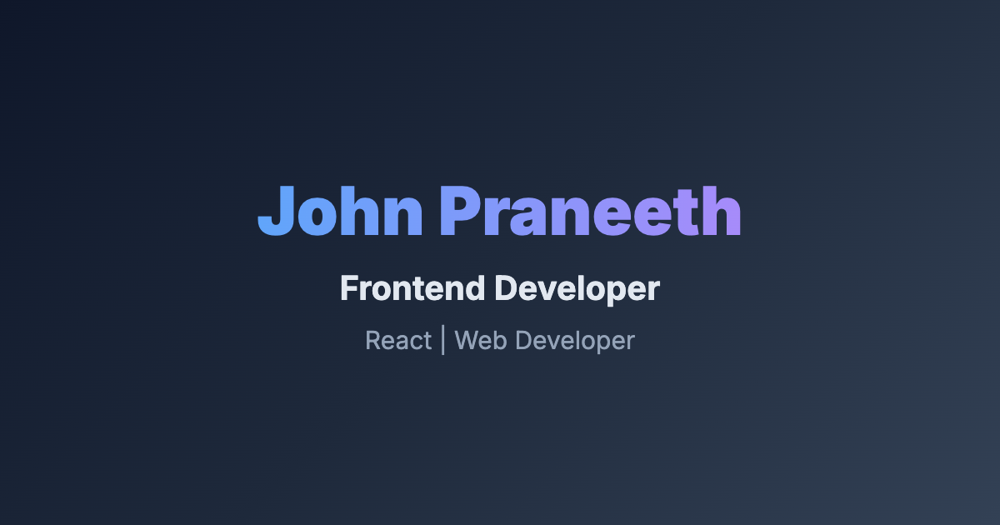

# John Praneeth – Full Stack Developer Portfolio 🚀

[](https://react.dev/)
[](https://www.typescriptlang.org/)
[](https://threejs.org/)
[](https://gsap.com/)
[](https://vitejs.dev/)

A high-performance, interactive 3D developer portfolio built with React, TypeScript, Three.js, and GSAP. It features a custom 3D character, instant-load rendering, and a premium glassmorphism design.

---

## Live Demo 🌐

**Live Site:** [https://www.johnpraneeth.tech](https://www.johnpraneeth.tech)



---

## 1. Problem Statement 💡

Traditional portfolios are often static or hindered by heavy loading screens. This project focuses on:
- **Instant Visibility:** Immediate content rendering without artificial loading delays.
- **Visual Storytelling:** A character-driven hero section reflecting personality and technical depth.
- **Micro-interactivity:** Custom cursor physics and hover-responsive elements.

---

## 2. Features ✨

- 🧑‍💻 **Interactive 3D Scene** – Custom Three.js character reacting to scroll and mouse motion.
- 🚀 **Zero-Delay Rendering** – native CSS transitions for instant entrance animations.
- 🎢 **Magnetic Custom Cursor** – Sophisticated cursor pull-effect on interactive elements.
- 🧩 **Optimized Projects Carousel** – High-density work showcase with detailed project context.
- 🧾 **Proof-Backed Experience** – Career timeline with direct verified proof links.
- 🧰 **Tech Orbit & Stack** – Dynamic GSAP-powered skill orbit and structured technical breakdown.
- 📱 **Fully Responsive** – Optimized for Desktop, Tablet, and Mobile devices.

---

## 3. Tech Stack 🛠️

**Frontend & Logic**
- React 18 / TypeScript
- Vite (Build Pipeline)
- Vanilla CSS (Glassmorphism & tokens)

**3D & Motion**
- Three.js (Standalone)
- GSAP + ScrollTrigger (Animation orchestration)
- Lenis (Precision smooth scrolling)

---

## 4. Folder Structure 📁

```text
.
├─ public/
│  ├─ images/            # Optimized project thumbnails
│  ├─ models/            # 3D assets and environment maps
│  └─ favicon.svg        # Custom minimalist branding
├─ src/
│  ├─ components/        # Isolated sections (Landing, About, Career, etc.)
│  │  ├─ Character/      # Custom Three.js WebGL scene
│  │  └─ styles/         # Scoped component styling
│  ├─ components/utils/  # Physics & Animation engines
│  ├─ data/              # Static rig and project configurations
│  ├─ App.tsx            # Composition root
│  └─ index.css          # Global design system
└─ package.json          # lean dependencies
```

---

## 5. Installation & Setup 🧩

### 1️⃣ Clone the Repository
```bash
git clone https://github.com/John-praneeth/Portfolio.git
cd Portfolio
```

### 2️⃣ Install Dependencies
```bash
npm install
```

### 3️⃣ Run in Development
```bash
npm run dev
```

---

## 6. Architecture 🧱

- **MainContainer:** Orchestrates global state, smooth-scrolling wrapper, and section flow.
- **Animation Hub:** `src/components/utils` centralizes GSAP timelines for zero race-conditions.
- **3D Hub:** Direct Three.js integration for maximum control over character reactivity.

---

## 7. License 📄

This project is open source and available under the **MIT License**.

---

## 8. Author 👨‍💻

**John Praneeth Dasari**
- GitHub: [https://github.com/John-praneeth](https://github.com/John-praneeth)
- LinkedIn: [https://www.linkedin.com/in/john-praneeth/](https://www.linkedin.com/in/john-praneeth/)
- Email: `johnpraneeth3030@gmail.com`
